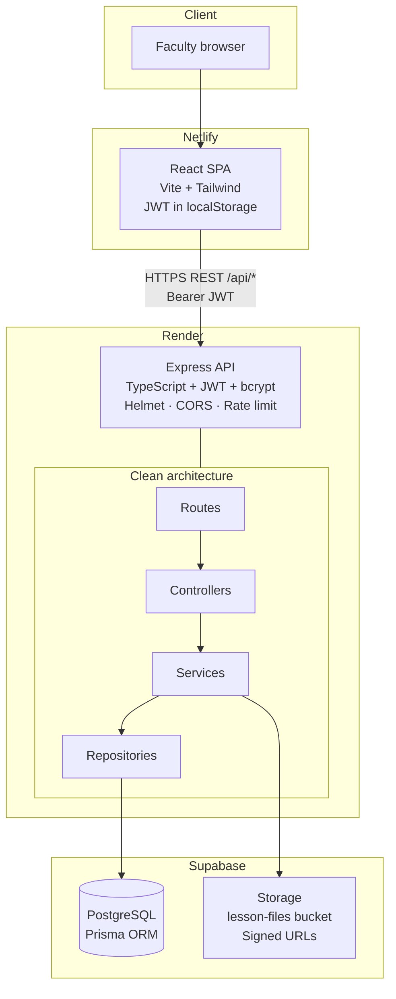
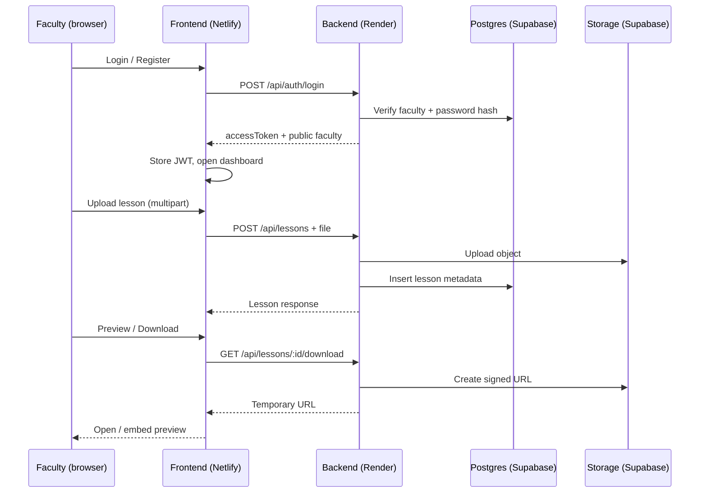

# Faculty Lesson Management System

Faculty-only LMS: upload, preview, edit, and delete lesson files.

| Layer | Stack | Deploy |
|-------|--------|--------|
| Frontend | React + TypeScript + Vite + Tailwind | **Netlify** |
| Backend | Express + TypeScript + Prisma + JWT | **Render** |
| Database | PostgreSQL | **Supabase** |
| Storage | Object storage | **Supabase Storage** |

> Deployment uses **native platform builds** (no Docker required).

---

## Architecture



**Request flow (lessons)**



| Path | Responsibility |
|------|----------------|
| `frontend/` | SPA: auth UI, dashboard, upload, PDF preview |
| `backend/src/modules/*` | Auth, lessons, storage (routes → controllers → services → repositories) |
| `backend/prisma/` | Schema + migrations |
| Supabase Postgres | Faculty + lesson metadata |
| Supabase Storage | Lesson files (private bucket + signed URLs) |

---

## Local development

### Backend

```bash
cd backend
cp .env.example .env          # fill DATABASE_URL, DIRECT_URL, JWT_SECRET, CORS_ORIGIN, Supabase
npm install
npx prisma generate
npm run prisma:migrate
npm run prisma:seed
npm run dev                   # http://localhost:4000
```

### Frontend

```bash
cd frontend
cp .env.example .env          # VITE_API_BASE_URL=http://localhost:4000/api
npm install
npm run dev                   # http://localhost:5173
```

### Production build (local verify)

```bash
# Backend
cd backend && npm run build && npm start

# Frontend (separate terminal)
cd frontend && npm run build && npm run preview
```

---

## Deploy backend → Render

### Build / start commands

| Setting | Value |
|---------|--------|
| Runtime | **Node** |
| Root Directory | `backend` |
| Build Command | `npm ci && npx prisma generate && npm run build` |
| Start Command | `npx prisma migrate deploy && npm start` |
| Health Check Path | `/api/health` |

(`render.yaml` at the repo root uses these settings.)

### Steps

1. Push the repo to GitHub.
2. [Render](https://dashboard.render.com) → **New → Web Service** → connect the repo  
   **or** **New → Blueprint** and select this repo (`render.yaml`).
3. Set **Root Directory** to `backend` (if creating manually).
4. Add environment variables (see table below). Do **not** override `PORT` — Render injects it.
5. Deploy. First start runs `prisma migrate deploy`.
6. Optional one-time seed (Render Shell):  
   `SEED_FACULTY_EMAIL=... SEED_FACULTY_PASSWORD=... npm run prisma:seed`
7. Copy the public URL, e.g. `https://faculty-lms-api.onrender.com`.

### Backend environment variables (Render)

| Variable | Required | Notes |
|----------|----------|-------|
| `NODE_ENV` | yes | `production` |
| `DATABASE_URL` | yes | Supabase **pooler** URL + `?pgbouncer=true&connection_limit=1` |
| `DIRECT_URL` | yes | Supabase **direct** URL (migrations) |
| `JWT_SECRET` | yes | `openssl rand -hex 32` (≥ 32 chars) |
| `JWT_EXPIRES_IN` | no | Default `8h` |
| `BCRYPT_SALT_ROUNDS` | no | Default `12` |
| `CORS_ORIGIN` | yes | Your Netlify URL(s), comma-separated, **no trailing slash** |
| `SUPABASE_URL` | yes* | Project URL |
| `SUPABASE_SERVICE_ROLE_KEY` | yes* | Service role (server only) |
| `SUPABASE_BUCKET` | no | Default `lesson-files` |
| `MAX_FILE_SIZE_BYTES` | no | Default `52428800` |
| `SIGNED_URL_EXPIRES_SEC` | no | Default `3600` |

\* Required for uploads/downloads. API boots without them but file routes return `503`.

Full template: `backend/.env.example`.

---

## Deploy frontend → Netlify

### Build settings

| Setting | Value |
|---------|--------|
| Base directory | `frontend` |
| Build command | `npm run build` |
| Publish directory | `frontend/dist` |
| Node version | `20` (or set in Netlify UI / `.nvmrc`) |

SPA routing is handled by `frontend/netlify.toml` (redirects all routes to `index.html`).

### Steps

1. [Netlify](https://app.netlify.com) → **Add new site** → import the GitHub repo.
2. Set **Base directory** to `frontend` (or configure via `frontend/netlify.toml`).
3. Add environment variable:
   - `VITE_API_BASE_URL` = `https://<your-render-service>.onrender.com/api`  
   (must include `/api`; baked in at **build** time).
4. Deploy.
5. Copy the Netlify URL (e.g. `https://your-site.netlify.app`).
6. Update Render `CORS_ORIGIN` to that exact origin and **redeploy the backend**.

### Frontend environment variables (Netlify)

| Variable | Required | Notes |
|----------|----------|-------|
| `VITE_API_BASE_URL` | yes | Public API base including `/api` |

Template: `frontend/.env.example`.

---

## Prisma migrations (production)

Migrations run automatically on Render via the start command:

```bash
npx prisma migrate deploy && npm start
```

To run manually (Render Shell or local against prod DB):

```bash
cd backend
npx prisma migrate deploy
```

Use `DIRECT_URL` for migrate; `DATABASE_URL` (pooler) for the running app.

---

## Post-deploy checklist

1. `GET https://<render>/api/health` → `status: "ok"`, `database: "connected"`.
2. Backend `CORS_ORIGIN` matches the Netlify origin exactly.
3. Frontend was built with the correct `VITE_API_BASE_URL`.
4. Login / register / upload PDF / preview / download / edit / delete.
5. Supabase bucket `lesson-files` exists and is private; service role key is set on Render only.

---

## Health response

`GET /api/health`

```json
{
  "success": true,
  "data": {
    "status": "ok",
    "uptime": "12s",
    "environment": "production",
    "database": "connected",
    "timestamp": "..."
  }
}
```

---

## Security (already wired on the API)

- Helmet, compression, HPP, rate limiting (global + auth)
- CORS allowlist, `x-powered-by` disabled, JSON body limit
- JWT HS256 + payload validation; strong `JWT_SECRET` required in production
- Timing-safe login; passwords never returned
- Centralized errors; no stack traces in production responses
- Graceful SIGTERM/SIGINT shutdown (Prisma disconnect)
- Swagger UI disabled when `NODE_ENV=production`

---

## Docs

- `setup.md` — local setup detail  
- `tointegrate.md` — integration runbook  
- `backend/.env.example` / `frontend/.env.example` — all variables  
- `render.yaml` — Render native Node blueprint  
- `frontend/netlify.toml` — SPA redirects for Netlify  
